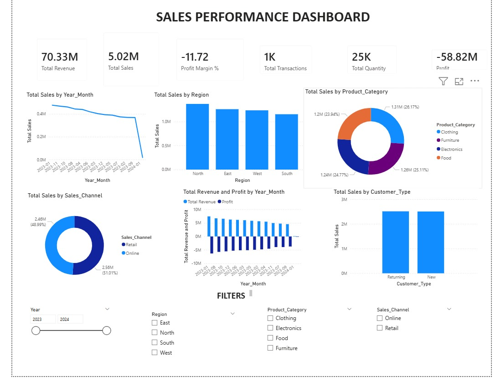
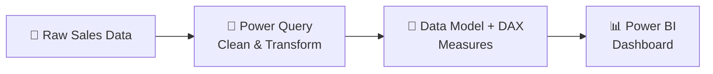

<div align="center">

# 📊 Sales Performance Dashboard

### *From raw transactions to clear decisions, in one page.*


<br>



</div>

<br>

## ✨ What is this?

An interactive **Power BI dashboard** that tracks sales across **time, region, category, channel and customer type** for **2023–2024**, so you can see what's selling, where, and to whom, in seconds.

<br>

## 🎯 At a Glance

<div align="center">

| 💰 Revenue | 🛒 Sales | 📦 Quantity | 🧾 Transactions | 📉 Profit |
|:---:|:---:|:---:|:---:|:---:|
| **70.33M** | **5.02M** | **25K** | **1K** | **-58.82M** |

</div>

<br>

## 📈 What's Inside

| | Visual | Shows |
|---|---|---|
| 📉 | **Line chart** | Monthly sales trend |
| 🗺️ | **Bar chart** | Sales by region (North · East · West · South) |
| 🍩 | **Donut chart** | Product category share |
| 🍩 | **Donut chart** | Online vs. Retail |
| 📊 | **Column chart** | Revenue vs. Profit by month |
| 👥 | **Bar chart** | New vs. Returning customers |

<br>

## 🎛️ Slice & Dice

Filter everything with one click:

`📅 Year` &nbsp; `🌍 Region` &nbsp; `🏷️ Product Category` &nbsp; `🛍️ Sales Channel`

<br>

## 🔍 Key Insights

> [!TIP]
> **🏆 North** is the top-selling region; **South** trails, but the gap is small.

> [!NOTE]
> **⚖️ Balanced mix:** Clothing 26% · Furniture 25% · Electronics 25% · Food 24%

> [!NOTE]
> **🏬 Retail 51%** vs **🌐 Online 49%**, and **new ≈ returning** customers (~2.5M each).

> [!WARNING]
> **📉 Sales trend downward** through the period, and **profit stays negative**. This is the biggest area to fix.

<br>

## 🧰 Built With



<br>

## 📁 Repo Structure

```
📦 Sales-Performance-Business-Intelligence-Dashboard
 ┣ 📊 Sales_Performance_Dashboard.pbix     → Power BI report
 ┣ 🗂️ sales_data.csv                        → Source dataset
 ┣ 🖼️ Sales_Data_Analysis_Photo.jpeg        → Dashboard preview
 ┗ 📝 README.md                            → You are here
```

<br>

## 🚀 Run It

```bash
git clone https://github.com/shreyaghorui222004/Sales-Performance-Business-Intelligence-Dashboard.git
```

Then open **`Sales_Performance_Dashboard.pbix`** in [Power BI Desktop](https://powerbi.microsoft.com/desktop/) (free) and start exploring. 🎉

<br>

<details>
<summary><b>🛠️ Known issues & next steps</b></summary>

<br>

- **Profit Margin** shows `-11.72` (a raw ratio, not a %). Format it as a percentage and check the denominator.
- **Revenue vs. Sales** differ a lot (70.33M vs 5.02M). Define each measure clearly.
- **2024-01** looks like a partial month, which explains the sharp drop at the end of the trend.

**Coming next:** YoY / MoM growth KPIs · top products table · drill-through pages · tooltips & bookmarks

</details>

<br>

---

<div align="center">

### 👩‍💻 Made by **Shreya**
B.Tech IT · Netaji Subhash Engineering College, Kolkata

[](https://github.com/shreyaghorui222004)
[]((https://www.linkedin.com/in/shreya-ghorui-63ab9b314/))

⭐ *If you like this project, drop a star!*

</div>
